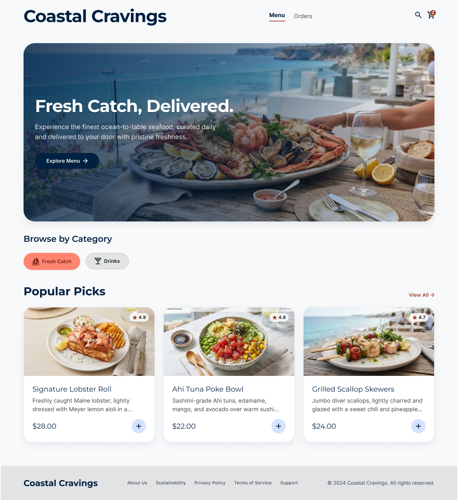
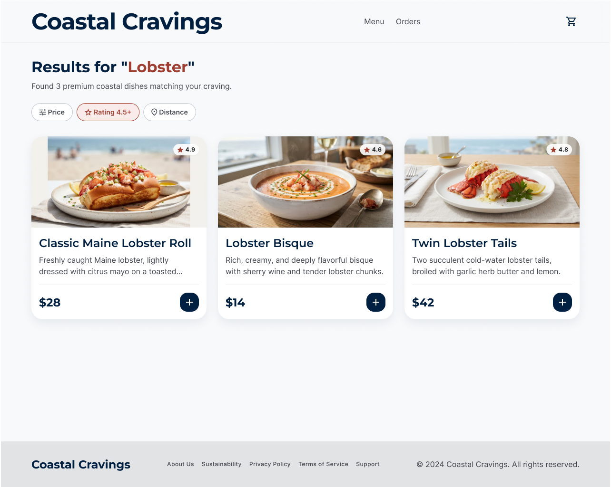
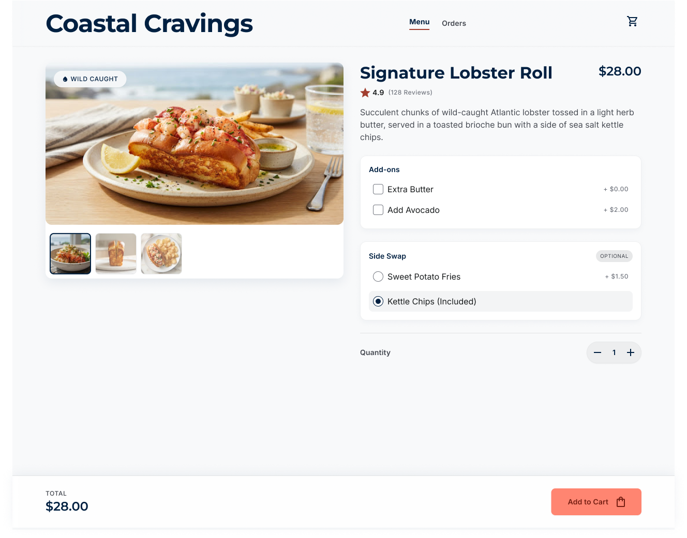
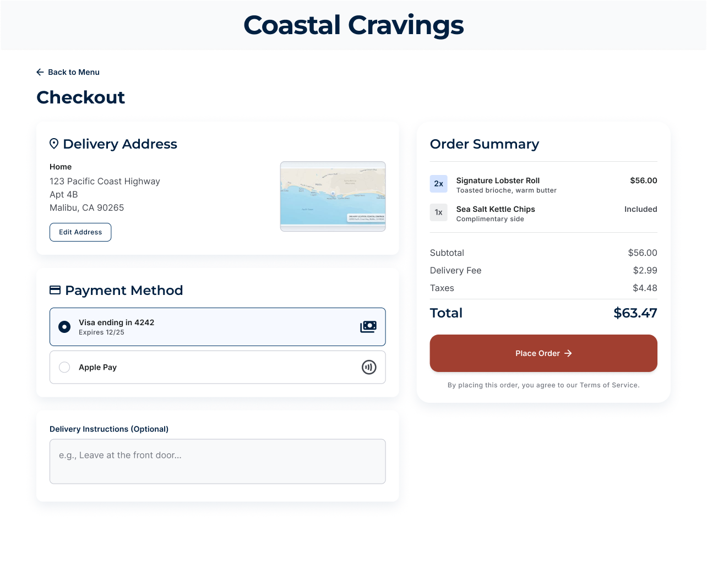

# 🌊 Coastal Cravings – Seafood Restaurant UI/UX Design



## 📌 Project Overview

**Coastal Cravings** is a modern UI/UX design for a premium seafood restaurant and online food ordering platform. The project focuses on creating a clean, elegant, and user-friendly interface that enables customers to browse seafood dishes, customize orders, search menu items, and complete secure online payments.

The design follows modern UI principles with a minimal layout, intuitive navigation, and responsive components to provide a seamless food ordering experience.

---

## 🎯 Project Objectives

- Design a modern seafood restaurant website.
- Provide an easy online ordering experience.
- Improve customer engagement through intuitive UI.
- Allow product customization before checkout.
- Create a responsive and visually appealing interface.

---

# ✨ Features

### 🏠 Home Page
- Attractive hero banner
- Food categories
- Popular seafood dishes
- Ratings and pricing
- Shopping cart preview


### 🔍 Search Page
- Search seafood dishes
- Filter by
  - Price
  - Rating
  - Distance
- View search results instantly



### 🍽 Food Details Page
- Large food preview
- Multiple product images
- Product description
- Add-ons selection
- Side swap options
- Quantity selector
- Dynamic price
- Add to Cart



### 🛒 Checkout Page
- Delivery Address
- Payment Method
- Delivery Instructions
- Order Summary
- Tax & Delivery Fee Calculation
- Place Order button



---

# 🖥 Screens Included

| Screen | Preview |
|---|---|
| Home Screen |  |
| Search Results |  |
| Food Details |  |
| Checkout |  |

---

# 🎨 Design System

### Color Palette

| Color | Usage |
|--------|-------|
| Navy Blue | Primary |
| Coral Orange | Buttons |
| White | Background |
| Light Gray | Cards |
| Dark Gray | Text |

---

### Typography

- Headings: Bold Sans Serif
- Body: Clean Sans Serif
- Modern minimal typography

---

## 🛠 Tools Used

- Figma
- UI Design Principles
- Auto Layout
- Components
- Variants
- Icons
- Prototyping

---

## 👨‍💻 Internship Details

**Organization:** CodTech IT Solutions

**Internship Role:** UI/UX Design Intern

**Intern ID:** CT08DN1136

**Duration:** 8 Weeks

### Internship Tasks

During the internship, I designed complete user interfaces and prototypes focusing on user-centered design principles. This project demonstrates:

- User Research
- Wireframing
- High-Fidelity UI Design
- Interactive Prototyping
- Responsive Design
- Component-Based Design System

---

## 📚 Skills Demonstrated

- UI Design
- UX Design
- User-Centered Design
- Wireframing
- Prototyping
- Design Thinking
- Auto Layout
- Responsive Design
- Component Design
- Visual Hierarchy
- Information Architecture

---

## 📂 Project Structure
```
Coastal-Cravings/
│
├── Home Screen
├── Search Results
├── Food Details
├── Checkout
├── assets/
│   ├── home.png
│   ├── search-results.png
│   ├── food-details.png
│   └── checkout.png
└── README.md
```

---

## 🚀 Future Improvements

- Dark Mode
- Order Tracking
- Customer Reviews
- Favorites
- User Login
- Online Payment Gateway
- Loyalty Rewards
- Restaurant Location Map
- AI Food Recommendations

---

## 📖 Learning Outcomes

This project helped me gain practical experience in:

- Designing responsive interfaces
- Building reusable UI components
- Improving usability
- Creating consistent design systems
- Designing complete user journeys
- Applying UX best practices

---

## 👤 Author

**Karthik J**

B.E. Computer Science Engineering

Full Stack Developer | UI/UX Designer

LinkedIn: *(Add your LinkedIn URL)*

GitHub: *(Add your GitHub URL)*

---

## ⭐ Acknowledgement

This project was successfully completed as part of the **UI/UX Design Internship at CodTech IT Solutions**
